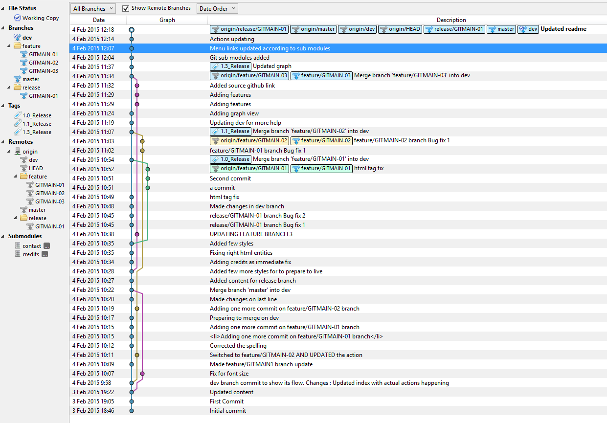

# git-workflow-main-project
To show Git workflow with multiple modules

            

                

                    <h2>This is to Explain how Git can work for multiple projects with several Branches</h2>
					   
					

							<h3>Actions going on</h3>
							<ul>
								<li>Added first set of files and created master branch with git init</li>
								<li>Updated few changes to master branch for to show commit flow</li>
								<li>Switched to dev branch after adding it from master branch</li>
								<li>Switched to feature/GITMAIN-01 branch after adding it from dev branch</li>
								<li>Adding one more commit on feature/GITMAIN-01 branch</li>
								<li>Adding one more commit on feature/GITMAIN-01 branch for to show the flow</li>
								<li>Switched to feature/GITMAIN-02 branch after adding it from dev branch</li>
								<li>Adding one more commit on feature/GITMAIN-02 branch</li>
								<li><b>Added release/GITMAIN-01 branch to prepare for production</b></li>								
								<li><b>release/GITMAIN-01 branch</b> Bug fix 1</li>
								<li><b>release/GITMAIN-01 branch</b> Bug fix 2</li>
								<li>Made changes in dev branch</li>
								<li>Update made on <b>feature/GITMAIN-01 branch</b> after dev branch got changes </li>								
								<li><b>feature/GITMAIN-02 branch</b> Bug fix 1</li>
								<li><b>feature/GITMAIN-02 branch</b> Bug fix 2</li>
								<li><b>Added release/GITMAIN-03 branch to prepare for production</b></li>
								<li>Switched to feature/GITMAIN-03 branch after adding it from dev branch</li>
								<li><b>Added submodules</b></li>
								<li>Updated menu links as per sub module</li>
								<li>See below for diagramatic view of this from sourcetree [Todo: Need to add detailed graph view of commits and branches as per timeline]</li>
								<li>Full credits goes to <a target="_blank" href="http://github.com/nvie">[Vincent Driessen]</a> from <a  target="_blank" href="http://nvie.com/posts/a-successful-git-branching-model/">his site</a> for this git flow</li>
								<li>
							<h3>Why this page and what else is here</h3>
							<ul>
								<li> This is to show and try explain a way to setup git workflow for your projects from dev, test and release</li>
								<li> It is also having sub-module of git to show how a main project can have multiple sub projects which all are totally independent by them-self as like this main git repo.</li>						
							</ul>
							</li>
								<li>		
							

								
								
Graph1 from release 1.1

							

								</li>
							</ul>
					

                   

            

        

